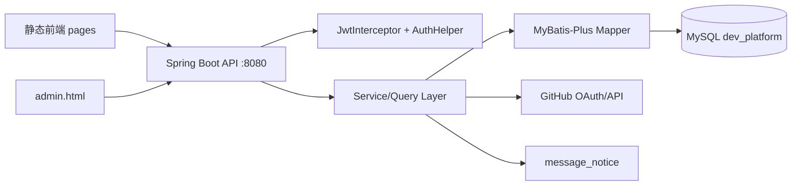

# 开源开发者协作与信用评估平台（后端）

本仓库为“开源开发者协作与信用评估平台”的后端服务（Spring Boot + MyBatis-Plus + JWT），配套前端为 **静态页面**（Vue3 CDN + Element Plus），默认通过 `request.js` 调用本服务。

## 技术栈
- **JDK**：8（`pom.xml` 已锁定 1.8 编译）
- **Spring Boot**：2.7.15
- **MyBatis-Plus**：3.5.3
- **安全**：JWT + 轻量 RBAC（user/admin）
- **数据库**：MySQL
- **可观测性**：请求 traceId（MDC），统一 `Result` 响应与全局异常处理

## 架构概览



## 10 分钟上手（本地跑通）

### 1) 准备 MySQL
创建数据库（名称与 `application.yml` 默认一致）：

```sql
CREATE DATABASE IF NOT EXISTS dev_platform DEFAULT CHARACTER SET utf8mb4;
```

确保 `application.yml` 中的数据源可用（默认示例）：
- host：`localhost:3306`
- db：`dev_platform`
- user：`root`
- password：`root123456`

> 启动后端时 `DatabaseSchemaInitializer` 会自动补齐必要表/字段/索引（含 `github_username` 唯一索引）。

### 2) 配置环境变量（推荐 setx 持久化）
GitHub OAuth 绑定与信用计算依赖如下环境变量（Windows）：

```powershell
setx GITHUB_CLIENT_ID "你的clientId"
setx GITHUB_CLIENT_SECRET "你的clientSecret"
setx GITHUB_TOKEN "你的GitHubToken"
setx GITHUB_PROXY_HOST "127.0.0.1"
setx GITHUB_PROXY_PORT "6478"
```

JWT 建议通过环境变量覆盖：

```powershell
setx APP_JWT_SECRET "change-this-jwt-secret"
setx APP_JWT_EXPIRATION_MS "604800000"
```

重要：`setx` 写入后需要**完全重启 Cursor/IDEA**，新启动的 Java 进程才能读到。

### 3) 启动后端
在项目根目录执行：

```powershell
.\mvnw.cmd -DskipTests spring-boot:run
```

启动成功标志：
- `Tomcat started on port(s): 8080`
- 日志中可看到 `[schema] database schema initialization done`

### 4) 启动前端（静态页面）
前端目录：`C:\Users\28994\Desktop\front`

用任意静态服务器启动（例：VSCode Live Server / `http-server`），确保：
- 前端能访问后端 `http://localhost:8080`
- GitHub OAuth 回调页为 `callback.html`

## 关键约定

### 统一响应结构（Result）
后端接口统一返回 `Result<T>`，失败时带 `code/message/errorCode/traceId` 等字段，前端在 `front/request.js` 统一处理 401/403/失败 toast。

### 鉴权
- 请求头：`Authorization: Bearer <token>`
- 管理员接口：`/api/admin/**`（由拦截器与 `AuthHelper.requireAdmin` 双重保护）

## 常见问题（FAQ）

### 1) 端口 8080 被占用
```powershell
netstat -ano | findstr :8080
taskkill /PID <PID> /F
```

### 2) GitHub OAuth 提示“配置缺失”
说明当前运行的 Java 进程读不到 `GITHUB_CLIENT_ID/GITHUB_CLIENT_SECRET`。
- 如果你刚执行了 `setx`：请**完全重启 Cursor/IDEA** 后再启动后端
- 或用当前终端临时注入：
```powershell
$env:GITHUB_CLIENT_ID="..."
$env:GITHUB_CLIENT_SECRET="..."
.\mvnw.cmd -DskipTests spring-boot:run
```

### 3) 同一 GitHub 账号被多个系统账号绑定
数据库层已对 `user.github_username` 建立唯一索引；后端绑定接口也会在写入前校验唯一性并返回明确提示。

## 目录结构（简要）
- `src/main/java/.../controller`：控制器
- `src/main/java/.../service`：业务/查询服务
- `src/main/java/.../config`：配置与初始化（含 `DatabaseSchemaInitializer`）
- `src/main/java/.../common`：`Result/ErrorCode/PageResult`
- `db/migrations`：索引等数据库变更脚本（可复现）

